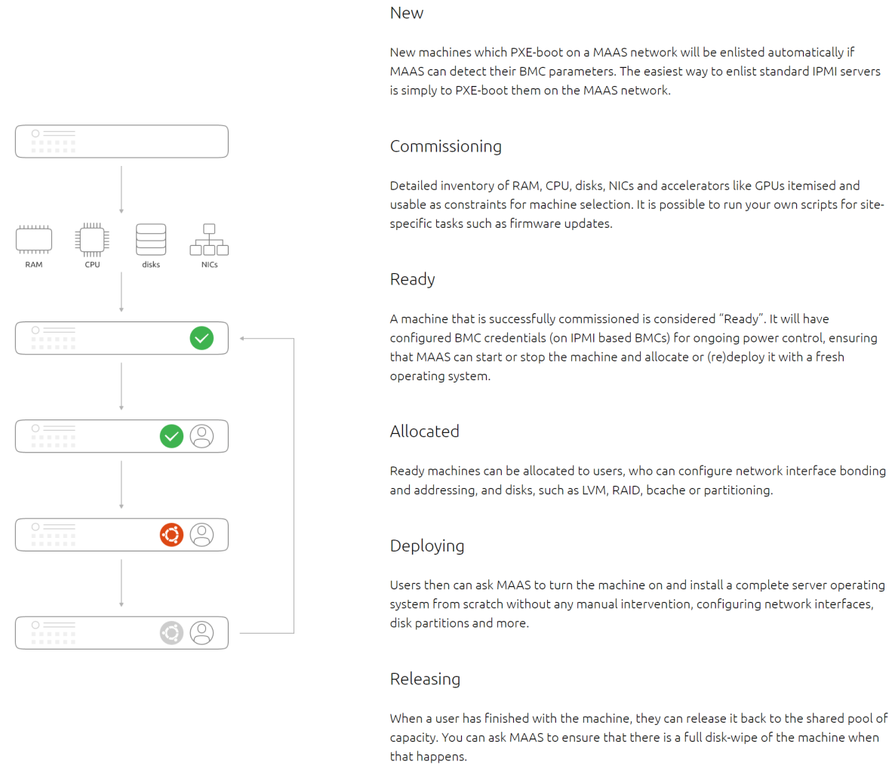

LernMAAS
========

Quelle: [MAAS How its works](https://maas.io/how-it-works)

- - - 

MAAS / IAAS Umgebung um Cluster von VMs oder Kubernetes auszusetzen

[MAAS](https://maas.io/how-it-works) steht für Self-Service-Remote-Installation von Windows, CentOS, ESXi und Ubuntu auf realen Servern. Es verwandelt das Rechenzentrum in eine Bare-Metal-Cloud.

Voraussetzungen
---------------

* Ein Netzwerk mit direkter Verbindung ins Internet aber ohne DHCP Server. Informationen zu Gateway IP und DNS Servern.
* Ein handelsüblicher PC laut Anforderungen des [MAAS](https://maas.io/docs/maas-requirements) Projektes, als Master.
* Eine oder mehrere PCs mit mindestens 32 GB RAM, 512 GB HD und wenn möglich mit [BMC](https://de.wikipedia.org/wiki/Baseboard_Management_Controller) Unterstützung. Diese dienen als Virtualisierungs-Server.
* Alle Nodes sollten mit mindestens einem 1 GB LAN verbunden sein.
* Optional: ein Gateway Server im Internet um via VPN ([WireGuard](https://www.wireguard.com/)) auf die VMs von aussen zuzugreifen. 

Installation
------------

* [MAAS Master und Worker Nodes](doc/MAAS/Install.md)
* [Gateway Server](doc/MAAS/Gateway.md)
* [Einbinden der Clients und Portweiterleitung](doc/MAAS/GatewayClient.md).
* [Virtualisierte Machinen in Virtualisierten Machinen](doc/MAAS/VMinVM.md)
* [Hilfsscripts](helper/)

Fragen und Antworten
--------------------

* [FAQ](doc/MAAS/FAQ.md) 

Maschinen Life Cycle
--------------------

Quelle: [MAAS How its works](https://maas.io/how-it-works)

- - -

Jede von MAAS verwaltete Maschine durchläuft einen Lebenszyklus - von der Registrierung (New), der Inventarisierung und Einrichtung von Firmware (Ready) oder anderen hardwarespezifischen Elementen (Commissioning). Anschließend erfolgt die Bereitstellung (Deploy) um sie schliesslich zurück in den Ruhestand (Ready) zu entlassen.

Neue VMs lassen sich über die [MAAS Weboberfläche](http://localhost:5240) oder via [MAAS CLI](doc/MAAS/CLI.md) erstellen.

Über die Weboberfläche ist `Pods` (Bare Metal Maschinen mit KVM) und anschliessend `Compose` aufzurufen.

Nach der Initialisierung der VM erscheinen diese als `Ready` und es kann mittels `Deploy` Ubuntu installiert werden.

Welche Software auf die VM installiert wird, bestimmt die Datei [config.yaml](https://github.com/mc-b/lernmaas/blob/master/config.yaml) anhand des Hostnamens.

Der Hostname ist wie folgt aufgebaut XXX-YY-Z
* XXX = Modul oder Kursname laut Eintrag in [config.yaml](https://github.com/mc-b/lernmaas/blob/master/config.yaml)
* YY  = fortlaufende Nummer um mehrere VMs pro Modul zur Verfügung zu stellen
* Z   = optionaler Suffix wird nicht ausgewertet. Kann z.B. die Klasse sein

Beispiele
* m100-01       - Daten charakterisieren, aufbereiten und auswerten (Inhalte von Thomas)
* m122-01-st17d - Modul 122, Maschine 01, Klasse st17d
* m122-01       - Modul 122, Maschine 01 nicht Klassengebunden
* m141-01-ap17a - Datenbanksystem in Betrieb nehmen (Beispiel mit Jupypter Notebooks)
* m183-01-wup18 - Applikationssicherheit implementieren (Kubernetes und Webgoat)
* m226-01       - Objektorientiert implementieren (Kubernetes mit 24 x BeakerX, in K8s Namespace, Umgebung)
* m239-01-st17a - Internet Server in Betrieb nehmen (VM mit Installiertem Apache Web Server und Samba Zugriff, Webseiten auf $HOME/data)
* m242-01-bistX - Mikroprozessoranwendung realisieren (Gruppenserver mit NodeRED, MQTT Server etc.)
* m254-01       - Geschäftsprozesse beschreiben (Kubernetes mit misegr/bpmn Umgebung, Frontend, Camunda, Backend) zu Demonstrationzwecken
* m300-01-vba   - Plattformuebergreifende Dienste in ein Netzwerk integrieren. Kubernetes Umgebung um ohne Installation mit dem Modul beginnen zu können
* m426-01       - Software mit agilen Methoden entwickeln. Demonstration moderner DevOps Umgebung mit CI/CD, Kanboard, Git ...
* dukmaster-01, dukworker-01-1, dukworker-01-2 - Kubernetes Master und zwei Worker Nodes 
* m000master-01, m000worker-01-1, ..., m000worker-01-5 - Kubernetes Master und fünf Worker Nodes mit TBZ Deployer

Konfigurationsdatei [config.yaml](https://github.com/mc-b/lernmaas/blob/master/config.yaml)
-------------------

    m242:
      vm:  
        storage: 32
        memory:  7680
        cores: 4
      services:
        nfs: true
        docker: true
        k8s: master
        wireguard: use
        ssh: use
        samba: false
        firewall: false
      scripts: modtec.sh
      repositories: https://github.com/mc-b/duk,https://github.com/mc-b/mlg 

Beispieleintrag aus [config.yaml](https://github.com/mc-b/lernmaas/blob/master/config.yaml)
- - -

[config.yaml](https://github.com/mc-b/lernmaas/blob/master/config.yaml) ist die zentrale Konfigurationsdatei für lernmaas.

In ihr stehen Defaulteinträge für VMs und welche Services und Software in die VMs installiert werden sollen.

#### VM

Definiert Standardgrössen für die VM. Wird durch [helper Scripts](helper/) ausgewertet.

* **storage** - Disk in GB
* **memory** - RAM in MB
* **cores** - Anzahl der CPU Cores

#### Services

Neben der Möglichkeit eigene Scripts oder Repositories, analog [lernkube](https://github.com/mc-b/lernkube) einzubinden, stehen eine Anzahl von Services zur Verfügung.

Die Services können pro VM in der Datei [config.yaml](https://github.com/mc-b/lernmaas/blob/master/config.yaml) aktiviert werden.

Es stehen folgende Services zur Verfügung:
* **nfs** - `true` = es werden $HOME/data, $HOME/template $HOME/config auf den MAAS Server weitergeleitet, bzw. gemountet.
* **wireguard** - `use` = ist einen Datei $HOME/config/wireguard/$HOSTNAME vorhanden wird diese als Konfigurationsdatei für WireGuard verwendet. Statt der Konfigurationsdatei genügt neu die Zuordnung zu einer AZ und der Tag `wireguard`. Bei Kubernetes wird zusätzlich als 1. IP nicht die interne IP sondern die von WireGuard verwendet.
* **ssh** - `generate` = erstellt einen SSH-Key pro VM, fügt den Public Key `.ssh/authorized_keys` an und kopiert den Private Key nach data/.ssh/. für den Zugriff von aussen. Zusätzlich wird ein Key für [putty](https://www.putty.org/) und ein Password mit [pwgen](https://www.pwdgen.org/) erzeugt. Das Password steht in der Datei `.ssh/passwd` und `data/.ssh/passwd`.
* **samba** - `true` = installiert die CIFS Freigabe Samba und gibt $HOME/data allgemein frei.
* **firewall** - `true` = installiert `ufw` als Firewall mit Standardeinstellungen
* **docker** - `true` = installiert Docker in der VM
* **k8s** - `master` = installiert einen Kubernetes Master, `worker` = installiert einen Kubernetes Worker und joint diesen mit dem Kubernetes Master. `minimal` installiert nur die absolut notwendigen K8s Services. `k3s` die [k3s](https://k3s.io/), `rancher` die [Rancher](https://rancher.com/) und `openshift` die [OpenShift](https://www.openshift.com/) Variante von Kubernetes. 

Details und die Services selber findet man im Verzeichnis [services](services/).

#### Scripts

Definiert welche Scripts, getrennt durch `,` nach den Services ausgeführt werden sollen.

Ein Beispiel ist z.B. die Installation des Apache Web Servers [apache.sh](scripts/apache.sh).

Die Scripts werden als User `ubuntu` in dessen HOME Verzeichnis ausgeführt. 

#### Repositories

Wie beim Projekt [lernkube](https://github.com/mc-b/lernkube) können weitere Repositories angegeben werden.

Diese werden in das Verzeichnis $HOME geklont und anschliessend, falls vorhanden, deren Script `scripts/install.sh` ausgeführt.

Ein Beispiel ist z.B. das [Modul 122](https://github.com/tbz-it/M122/blob/master/scripts/install.sh) welche zusätzliche Software in die VM installiert.

Das install.sh Script wird im geklonten Verzeichnis als User `ubuntu` ausgeführt.

### Links

* [MAAS](https://maas.io/how-it-works)
* [Cloud-init](https://cloudinit.readthedocs.io/en/latest/)
* [Curtin](https://curtin.readthedocs.io/en/latest/topics/overview.html)
* [Bare Metal in a Cloud Native World](https://thenewstack.io/bare-metal-in-a-cloud-native-world/)
 