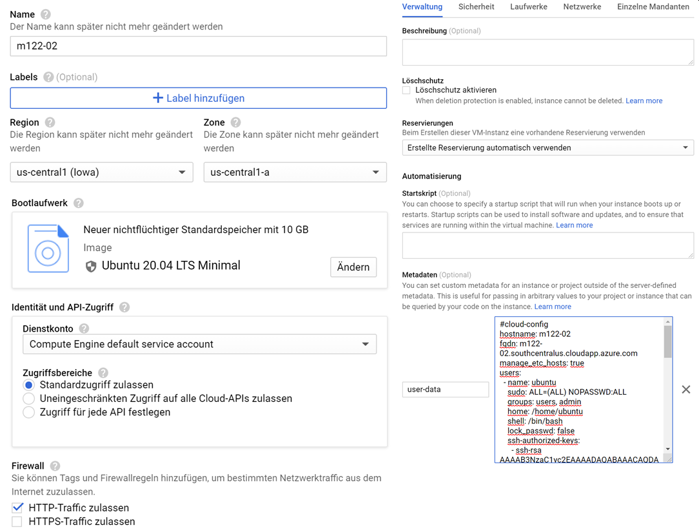
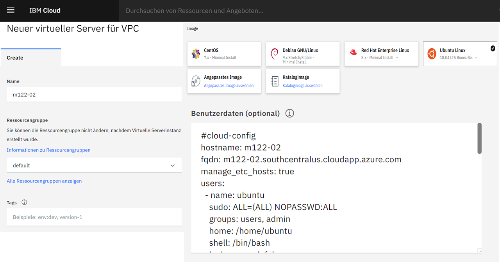

lernMAAS in der Public Cloud
============================

## Inhaltsverzeichnis

* [Azure Cloud](#azure-cloud)
* [AWS Cloud](#aws-cloud)
* [Google Cloud](#google-cloud)
* [IBM Cloud](#ibm-cloud)

***
### Cloud-init Erstellen

Weil [lernMAAS](github.com/mc-b/lernmaas) [Cloud-init](https://cloudinit.readthedocs.io/)  zur Initialiserung der VMs verwendet kann [lernMAAS](github.com/mc-b/lernmaas) auf jeder öffentlichen Cloud (Google, IBM, [AWS](https://docs.aws.amazon.com/AWSEC2/latest/UserGuide/user-data.html), [Azure](https://docs.microsoft.com/en-us/azure/virtual-machines/linux/using-cloud-init) etc.) eingesetzt werden.

Die entsprechende Cloud Plattform muss 
* Ubuntu Images (18.xx, besser 20.xx) 
* [Cloud-init](https://cloudinit.readthedocs.io/en/latest/topics/datasources.html)

unterstützen.

Dazu muss einmalig eine `cloud-init.cfg` Datei mit einem SSH-Key erstellt werden:

    export VMNAME=m122-02

    ssh-keygen -t rsa -b 4096 -f id_rsa -C cloud-init -N "" -q
    
    cat <<%EOF% >cloud-init.cfg
    #cloud-config
    hostname: ${VMNAME}
    fqdn: ${VMNAME}.southcentralus.cloudapp.azure.com
    manage_etc_hosts: true
    users:
      - name: ubuntu
        sudo: ALL=(ALL) NOPASSWD:ALL
        groups: users, admin
        home: /home/ubuntu
        shell: /bin/bash
        lock_passwd: false
        ssh-authorized-keys:
          - $(cat id_rsa.pub)
    # login ssh and console with password
    ssh_pwauth: true
    disable_root: false
    packages:
      - git 
      - curl 
      - wget
      - jq
      - markdown
      - nmap
      - traceroute
    runcmd:
      - git clone https://github.com/mc-b/lernmaas /opt/lernmaas
      - sudo su - ubuntu -c "cd /opt/lernmaas && bash -x services/cloud-init.sh"
    %EOF%
    
Diese Datei ist, beim Erstellen der VM, in der Cloud, mitzugeben.  

***
### Azure Cloud

> [⇧ **Nach oben**](#inhaltsverzeichnis)

---

Beim Azure UI ist unter `Erweitert` der Inhalt der Datei `cloud-init.cfg` anzugeben.

Ausserdem ist, je nach Anforderungen, auf die richtige Grösse vom RAM und HD zu achten.

#### Azure CLI

Nach der [Installation des Azure CLI](https://docs.microsoft.com/en-us/cli/azure/install-azure-cli?view=azure-cli-latest) auf der lokalen Maschine, kann die VM mittels diesem angelegt werden. 

Für das Modul [M122](https://github.com/tbz-it/M122) sieht das z.B. wie folgt aus.

Erstellen der `cloud-init.cfg` Datei und SSH-Key mit `export VMNAME=m122-02`, wie oben beschrieben. 

Anmelden an der Azure Cloud und erstellen einer Ressource Gruppe, wo unsere VMs abgelegt werden:

    az login
    
    export GROUP=m122
    az group create --name ${GROUP} --location southcentralus
    
Erstellen der VM mit Size Standard_D2_v4 ([mit 8 GB RAM, 2 CPUs, 30 GB HD](https://azure.microsoft.com/de-de/pricing/details/virtual-machines/linux/)).
    
    az vm create --resource-group ${GROUP} --name ${VMNAME} --image UbuntuLTS --size Standard_D2_v4 --location southcentralus --custom-data cloud-init.cfg    

**Hinweis**: Kubernetes auf Azure braucht mindestens eine [Standard_D4_v4](https://azure.microsoft.com/de-de/pricing/details/virtual-machines/linux/) Instanz Type.

    
Und für den einfacheren Zugriff, DNS Namen eintragen
    
    az network public-ip update --resource-group ${GROUP} --name ${VMNAME}PublicIP --dns-name ${VMNAME}
    
Anschliessend erfolgt die Installation der Software auf der VM mittels Cloud-init. Der aktuelle Status und das Log kann wie folgt abgefragt werden.

    ssh -i id_rsa ubuntu@${VMNAME}.southcentralus.cloudapp.azure.com sudo cloud-init status
    ssh -i id_rsa ubuntu@${VMNAME}.southcentralus.cloudapp.azure.com sudo tail -f /var/log/cloud-init-output.log    

Nach Beendigung von Cloud-init, kopiert man die Zugriffsinformationen auf die lokale Maschine. Aus Sicherheitsgründen, löschen wir diese Informationen auf der VM weg.

    scp -i id_rsa -rp ubuntu@${VMNAME}.southcentralus.cloudapp.azure.com:data/.ssh .
    ssh -i id_rsa ubuntu@${VMNAME}.southcentralus.cloudapp.azure.com rm -rf data/.ssh
    
Am Schluss können wir die Ports der VM freigeben.

    az vm open-port --port 80 --resource-group ${GROUP} --name ${VMNAME}
    az vm open-port --port 6443 --resource-group ${GROUP} --name ${VMNAME} # Kubernetes API

Um die VM und alle Ressourcen wieder freizugeben, verwenden wir:

    az group delete --name ${GROUP} --yes

#### Links

* [Create a Linux server VM by using the Azure CLI in Azure Stack Hub](https://docs.microsoft.com/en-us/azure-stack/user/azure-stack-quick-create-vm-linux-cli?view=azs-1908)
* [How to use cloud-init to customize a Linux virtual machine in Azure on first boot](https://docs.microsoft.com/en-us/azure/virtual-machines/linux/tutorial-automate-vm-deployment)

***
### AWS Cloud

> [⇧ **Nach oben**](#inhaltsverzeichnis)

---

Bei der AWS Cloud ist Inhalt der Datei `cloud-init.cfg` bei [Step 3: Configure Instance Details](https://docs.aws.amazon.com/AWSEC2/latest/UserGuide/launching-instance.html#configure_instance_details_step) im Feld `User Data` einzutragen.

Der Inhalt muss mit `#cloud-config` beginnen.

Ausserdem ist, je nach Anforderungen, auf die richtige Grösse vom RAM und HD zu achten. Am besten eignen sich die t2... Instanz Typen ab 1 GB RAM.

#### AWS CLI

Nach der [Installation des AWS CLI](https://docs.aws.amazon.com/cli/latest/userguide/install-cliv2.html) auf der lokalen Maschine, kann die VM mittels diesem angelegt werden. 

Für das Modul [M122](https://github.com/tbz-it/M122) sieht das z.B. wie folgt aus.

Erstellen der `cloud-init.cfg` Datei und SSH-Key mit `export VMNAME=m122-02`, wie oben beschrieben. Auf den Eintrag `fqdn:` kann dabei verzichtet werden.

Im AWS UI, neuen [User](https://console.aws.amazon.com/iam/home?region=eu-central-1#/users) erstellen und AmazonEC2FullAccess Rechte erteilen.

.cvs Datei downloaden und an einem sichern Ort speichern.

Einloggen in AWS

    aws configure
 
    AWS Access Key ID [****************WBM7]:
    AWS Secret Access Key [****************eKJA]:
    Default region name [eu-central-1]:
    Default output format [None]:

Anzeige der verfügbaren Images, für die angegebene Region:
             
     aws ec2 describe-images --owners self amazon --output table

ID, z.B. von Ubuntu 20 LTS `ami-0767046d1677be5a0` notieren.

Security Group erstellten und Ports öffnen

    aws ec2 create-security-group --group-name lernmaas --description "Standard Ports"
    aws ec2 authorize-security-group-ingress --group-name lernmaas --protocol tcp --port 22 --cidr 0.0.0.0/0
    aws ec2 authorize-security-group-ingress --group-name lernmaas --protocol tcp --port 80 --cidr 0.0.0.0/0   
    
Block Device Grösse festlegen und als JSON speichern

    cat <<%EOF% >device.json
    [ {
        "DeviceName": "/dev/sda1",
        "Ebs":
        {
          "VolumeSize": 30,
          "DeleteOnTermination": true
        }
    } ]
    %EOF%
    
Anschliessend die Instance starten. Die Einträge `tag-specifications` sind optional. Diese sind aber hilfreich, zum Wiederfinden oder einfach zur Gruppierung von VMs, weil AWS keine Gruppen wie MAAS oder Azure kennt.

    aws ec2 run-instances --image-id ami-0767046d1677be5a0 \
        --security-group-ids lernmaas \
        --instance-type t2.micro \
        --count 1 \
        --user-data file://cloud-init.cfg \
        --block-device-mappings file://device.json \
        --tag-specifications 'ResourceType=instance,Tags=[{Key=class,Value=st17a},{Key=modul,Value=m122}]' 
       
Für die meinsten Module sollte der Instanze Typ `t2.micro` (1 CPU, 1 GB RAM) ausreichend sein. Für Umgebungen, wie z.B. M300, sollte ein Instanze Typ nicht kleiner als `t3.large` (2 CPU, 8 GB RAM) verwendet werden. 

    export VMNAME=m300-03
    export GROUP=m300
    # cloud-init Datei erzeugen wie oben
    
    aws ec2 run-instances --image-id ami-0767046d1677be5a0 \
        --security-group-ids lernmaas \
        --instance-type t3.xlarge \
        --count 1 \
        --block-device-mappings file://device.json \
        --user-data file://cloud-init.cfg     
     
Anschlissend können wir uns die laufenden VMs anzeigen

    aws ec2 describe-instances --output table

#### Links

* [Running commands on your Linux instance at launch](https://docs.aws.amazon.com/AWSEC2/latest/UserGuide/user-data.html)

***
### Google Cloud

> [⇧ **Nach oben**](#inhaltsverzeichnis)

---

Bei der Google Cloud ist der Inhalt der Datei `cloud-init.cfg` als Meta-Data im Feld `User Data` einzutragen.

Der Inhalt muss mit `#cloud-config` beginnen.

Als Betriebssystem ist Ubuntu zu wählen und auf die richtige Grösse vom RAM und HD zu achten. 

***
### IBM Cloud

> [⇧ **Nach oben**](#inhaltsverzeichnis)

---

In der IBM Cloud ist ein virtueller Server für VPC zu Erstellen. Der Inhalt der Datei `cloud-init.cfg` ist im Feld `Benutzerdaten` zu kopieren.

#### Links

* [Bereitstellung mit einem cloud-init-fähigen Image](https://cloud.ibm.com/docs/image-templates?topic=image-templates-provisioning-with-a-cloud-init-enabled-image)
* [User data](https://cloud.ibm.com/docs/vpc-on-classic-vsi?topic=vpc-on-classic-vsi-user-data)

### Hinweise

**Bei den VMs wird davon ausgegangen, dass sie in einem geschützten Umfeld (VPN) laufen. Deshalb werden Zugriffsinformationen wie Passwörter etc. in der Web Oberfläche angezeigt.**

* VMs mittels VPN, z.B. [WireGuard](https://www.wireguard.com/), absichern. Die Abhandlung ist in lernMAAS vorhanden, muss aber für die Cloud angepasst werden.
* Die Abhandlung findet man im Script [wireguard.sh](https://github.com/mc-b/lernmaas/blob/master/services/wireguard.sh).

WireGuard erwartet die Konfigurationsdatei als `/home/ubuntu/config/wireguard/$(hostname).conf`. 

Diese Datei kann mittels Erweiterung der `cloud-init.cfg` Datei erzeugt werden.

    # cloud-config
    write_files:
    - owner: ubuntu:ubuntu
      path: /home/ubuntu/config/wireguard/${VNMAME}.conf
      content: |
      [Interface]
        PrivateKey = .....
        Address = 10.1.40./24
        
        [Peer]
        PublicKey = ....
        AllowedIPs = 10.1.40.0/24
        Endpoint = wireguard.gateway.ch:51820

**Persistenter Speicher**

* In einer [MAAS](https://maas.io) wird das Verzeichnis `$HOME/data` auf dem Rack Server gespeichert und ist auch nach dem löschen der VM vorhanden.
* Der persistente Speicher wird im Script [nfs.sh](https://github.com/mc-b/lernmaas/blob/master/services/nfs.sh) verbunden.

**Kubernetes - .kube/config**

In der Konfigurationsdatei für `kubectl` von Kubernetes steht, je nach Cloud, eine interne IP-Adresse.

    apiVersion: v1
    clusters:
    - cluster:
        certificate-authority-data: 
        server: https://10.0.1.4:6443

Diese ist durch den vollen DNS Namen (`hostname -f`) zu ersetzen

    apiVersion: v1
    clusters:
    - cluster:
        certificate-authority-data: 
        server: https://m300-01.southcentralus.cloudapp.azure.com:6443
  
