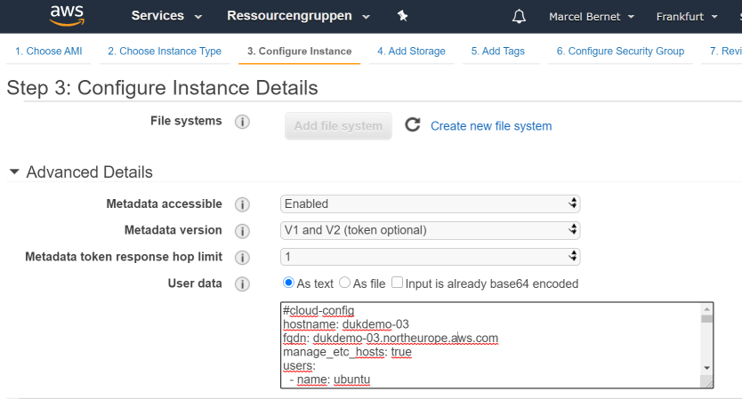

lernMAAS in der Public Cloud
============================

Weil [lernMAAS](github.com/mc-b/lernmaas) [Cloud-init](https://cloudinit.readthedocs.io/)  zur Initialiserung der VMs verwendet kann [lernMAAS](github.com/mc-b/lernmaas) auf jeder öffentlichen Cloud (Google, IBM, [AWS](https://docs.aws.amazon.com/AWSEC2/latest/UserGuide/user-data.html), [Azure](https://docs.microsoft.com/en-us/azure/virtual-machines/linux/using-cloud-init) etc.) eingesetzt werden.

Die entsprechende Cloud Plattform muss 
* Ubuntu Images (18.xx, besser 20.xx) 
* [Cloud-init](https://cloudinit.readthedocs.io/en/latest/topics/datasources.html)

unterstützen.

Dazu muss einmalig eine `cloud-init.cfg` Datei mit einem SSH-Key erstellt werden:

    export VMNAME=m122-02

    ssh-keygen -t rsa -b 4096 -f id_rsa -C cloud-init -N "" -q
    
    cat <<%EOF% >cloud-init.cfg
    #cloud-config
    hostname: ${VMNAME}
    fqdn: ${VMNAME}.northeurope.cloudapp.azure.com
    manage_etc_hosts: true
    users:
      - name: ubuntu
        sudo: ALL=(ALL) NOPASSWD:ALL
        groups: users, admin
        home: /home/ubuntu
        shell: /bin/bash
        lock_passwd: false
        ssh-authorized-keys:
          - $(cat id_rsa.pub)
    # login ssh and console with password
    ssh_pwauth: true
    disable_root: false
    packages:
      - git 
      - curl 
      - wget
      - jq
      - markdown
      - nmap
      - traceroute
    runcmd:
      - git clone https://github.com/mc-b/lernmaas /opt/lernmaas
      - sudo su - ubuntu -c "cd /opt/lernmaas && bash -x services/cloud-init.sh"
    %EOF%
    
Diese Datei ist, beim Erstellen der VM, in der Cloud, mitzugeben.  

***
### Installation VM via Azure UI

---

Beim Azure UI ist unter `Erweitert` der Inhalt der obigen Datei anzugeben.

Ausserdem ist, je nach Anforderungen, auf die richtige Grösse vom RAM und HD zu achten.

### Installation via Azure CLI

Nach der [Installation des Azure CLI](https://docs.microsoft.com/en-us/cli/azure/install-azure-cli?view=azure-cli-latest) auf der lokalen Maschine, kann die VM mittels diesem angelegt werden. 

Für das Modul [M122](https://github.com/tbz-it/M122) sieht das z.B. wie folgt aus.

Erstellen der `cloud-init.cfg` Datei und SSH-Key mit `export VMNAME=m122-02`, wie oben beschrieben.

Anmelden an der Azure Cloud und erstellen einer Ressource Gruppe, wo unsere VMs abgelegt werden:

    az login
    
    export GROUP=m122
    az group create --name ${GROUP} --location northeurope
    
Erstellen der VM mit Size Standard_F4s_v2 ([mit 8 GB RAM, 4 CPUs, 30 GB HD](https://azure.microsoft.com/de-de/pricing/details/virtual-machines/linux/))
    
    az vm create --resource-group ${GROUP} --name ${VMNAME} --image UbuntuLTS --size Standard_F4s_v2 --location northeurope --custom-data cloud-init.cfg    
    
Und für den einfacheren Zugriff, DNS Namen eintragen
    
    az network public-ip update --resource-group ${GROUP} --name ${VMNAME}PublicIP --dns-name ${VMNAME}
    
Anschliessend erfolgt die Installation der Software auf der VM mittels Cloud-init. Der aktuelle Status und das Log kann wie folgt abgefragt werden.

    ssh -i id_rsa ubuntu@${VMNAME}.northeurope.cloudapp.azure.com sudo cloud-init status
    ssh -i id_rsa ubuntu@${VMNAME}.northeurope.cloudapp.azure.com sudo tail -f /var/log/cloud-init-output.log    

Nach Beendigung von Cloud-init, kopiert man die Zugriffsinformationen auf die lokale Maschine. Aus Sicherheitsgründen, löschen wir diese Informationen auf der VM weg.

    scp -i id_rsa -rp ubuntu@${VMNAME}.northeurope.cloudapp.azure.com:data/.ssh .
    ssh -i id_rsa ubuntu@${VMNAME}.northeurope.cloudapp.azure.com rm -rf data/.ssh
    
Am Schluss können wir die Ports der VM freigeben.

    az vm open-port --port 80 --resource-group ${GROUP} --name ${VMNAME}
    az vm open-port --port 6443 --resource-group ${GROUP} --name ${VMNAME} # Kubernetes API

Um die VM und alle Ressourcen wieder freizugeben, verwenden wir:

    az group delete --name ${GROUP} --yes

#### Links

* [Create a Linux server VM by using the Azure CLI in Azure Stack Hub](https://docs.microsoft.com/en-us/azure-stack/user/azure-stack-quick-create-vm-linux-cli?view=azs-1908)
* [How to use cloud-init to customize a Linux virtual machine in Azure on first boot](https://docs.microsoft.com/en-us/azure/virtual-machines/linux/tutorial-automate-vm-deployment)

***
### Installation VM via AWS UI

---

Bei der AWS Cloud ist der obige Inhalt in [Step 3: Configure Instance Details](https://docs.aws.amazon.com/AWSEC2/latest/UserGuide/launching-instance.html#configure_instance_details_step) im Feld `User Data` einzutragen.

Der Inhalt muss mit `#cloud-config` beginnen.

Ausserdem ist, je nach Anforderungen, auf die richtige Grösse vom RAM und HD zu achten. Am besten eignen sich die t2... Instanz Typen ab 1 GB RAM.

#### Links

* [Running commands on your Linux instance at launch](https://docs.aws.amazon.com/AWSEC2/latest/UserGuide/user-data.html)

### Hinweise

**Bei den VMs wird davon ausgegangen, dass sie in einem geschützten Umfeld (VPN) laufen. Deshalb werden Zugriffsinformationen wie Passwörter etc. in der Web Oberfläche angezeigt.**

* VMs mittels VPN, z.B. [WireGuard](https://www.wireguard.com/), absichern. Die Abhandlung ist in lernMAAS vorhanden, muss aber für die Cloud angepasst werden.
* Die Abhandlung findet man im Script [wireguard.sh](https://github.com/mc-b/lernmaas/blob/master/services/wireguard.sh).

WireGuard erwartet die Konfigurationsdatei als `/home/ubuntu/config/wireguard/$(hostname).conf`. 

Diese Datei kann mittels Erweiterung der `cloud-init.cfg` Datei erzeugt werden.

    # cloud-config
    write_files:
    - owner: ubuntu:ubuntu
      path: /home/ubuntu/config/wireguard/${VNMAME}.conf
      content: |
      [Interface]
        PrivateKey = .....
        Address = 10.1.40./24
        
        [Peer]
        PublicKey = ....
        AllowedIPs = 10.1.40.0/24
        Endpoint = wireguard.gateway.ch:51820

**Persistenter Speicher**

* In einer [MAAS](https://maas.io) wird das Verzeichnis `$HOME/data` auf dem Rack Server gespeichert und ist auch nach dem löschen der VM vorhanden.
* Der persistente Speicher wird im Script [nfs.sh](https://github.com/mc-b/lernmaas/blob/master/services/nfs.sh) verbunden.

**Kubernetes - .kube/config**

In der Konfigurationsdatei für `kubectl` von Kubernetes steht, je nach Cloud, eine interne IP-Adresse.

    apiVersion: v1
    clusters:
    - cluster:
        certificate-authority-data: 
        server: https://10.0.1.4:6443

Diese ist durch den vollen DNS Namen (`hostname -f`) zu ersetzen

    apiVersion: v1
    clusters:
    - cluster:
        certificate-authority-data: 
        server: https://m300-01.northeurope.cloudapp.azure.com:6443
  
