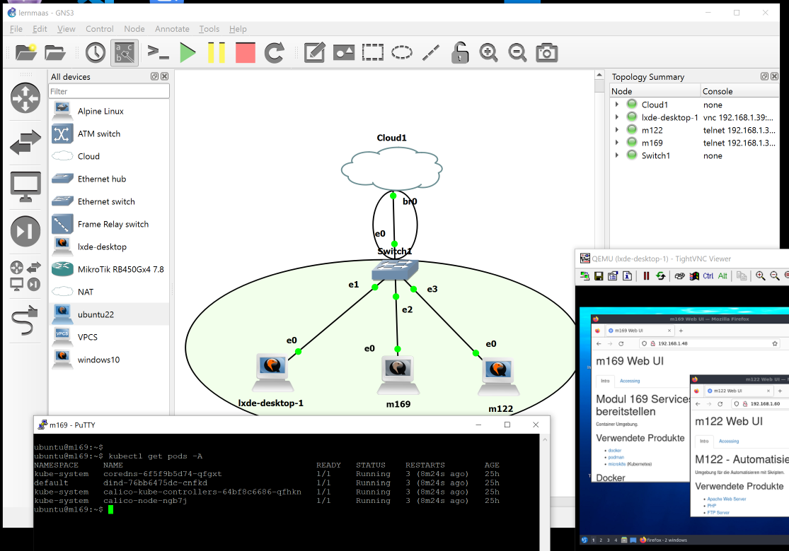
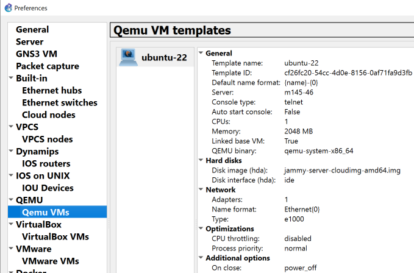
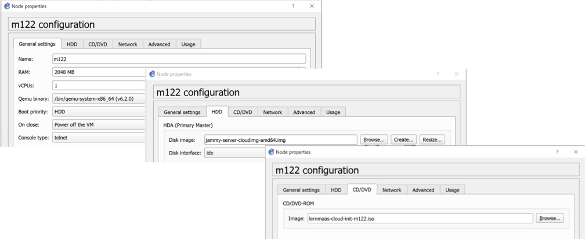

Graphical Network Simulator-3 (GNS3)
====================================

- - - 

Graphical Network Simulator-3 ist ein Netzwerk-Software-Emulator, der erstmals 2008 veröffentlicht wurde. Er ermöglicht die Kombination von virtuellen und realen Geräten, die zur Simulation komplexer Netzwerke verwendet werden.

Installation
------------

Falls die Installation noch nicht erfolgt ist, GNS3 Installieren

**Variante a)** in einer frischen Ubuntu Umgebung

    cd /tmp
    curl https://raw.githubusercontent.com/GNS3/gns3-server/master/scripts/remote-install.sh > gns3-remote-install.sh
    sudo bash gns3-remote-install.sh
    
**Variante b)** TBZ GNS3 Umgebung mit OpenVPN, siehe [hier](https://gitlab.com/ch-tbz-it/Stud/allgemein/tbzcloud-gns3).

**Variante c)** in einer LernMAAS Umgebung die VMs erstellen und "VM in VM" aktivieren

    ssh ubuntu@<IP Rack Server>
    cd lernmaas
    git pull
    createvms config.yaml m145 4 <Klasse>
    
Warten bis die VMs den Status `Ready` erreicht haben und dann "VM in VM" aktivieren

    enablevminvm m145
    
Nach der Installation sollte überprüft werden, ob die Virtualisierung aktiviert ist:    

    sudo virt-host-validate qemu
    
Wenn der erste Eintrag `FAIL` anzeigt ist die KVM Unterstützung zu deaktivieren. Dazu die Konfigurationsdatei `/opt/gns3//.config/GNS3/2.2/gns3_server.conf` um folgenden Eintrag ergänzen:

    [Qemu]
    enable_kvm = false
    

Cloud-Image aufbereiten
-----------------------

- - -

Um innerhalb von GNS3 VMs mittels Cloud-init zu erzeugen, braucht es ein Ubuntu Cloud-Image. Das Cloud-Image hat nur eine Dateisystem Grösse von 2 GB deshalb muss nach dem Download, die Grösse des Images bzw. des Dateisystem vergrössert werden. Die Befehle sind wie folgt und finden in der GNS3 VM statt: 

    sudo apt-get install -y genisoimage
    sudo wget -O /opt/gns3/images/QEMU/jammy-server-cloudimg-amd64.img https://cloud-images.ubuntu.com/jammy/current/jammy-server-cloudimg-amd64.img
    sudo qemu-img resize /opt/gns3/images/QEMU/jammy-server-cloudimg-amd64.img +30G
    
Anschliessend ist das Cloud-Image, in der GNS3 Oberfläche -> Edit -> Preferences -> als Qemu VMs mit obigen Werten einzutragen.

Nachdem Cloud-init durchgelaufen ist, kann mittels User: `ubuntu`, Password: `insecure` in die VM eingeloggt werden.

End-Devices
-----------

- - -

Nachdem das Cloud-Image als Qemu VM eingetragen wurde, können VMs erzeugt werden. 

Dazu die VM via Drag und Drop auf der Design Oberfläche platzieren und als Disk Image das Cloud-Image und als CD/DVD das ISO Image des Moduls eintragen.

Die ISO Images der Module befinden sich [hier](../../gns3). Sie beinhalten eine `meta-data` und eine `user-data` Datei. In `meta-data` steht der Hostname und in `user-data`das Cloud-init Script.

Anschliesend die VM mit der Cloud, Switch oder Router etc. verbinden und starten. 

Es wird automatisch die richtige Software für das Modul installiert.

Tips & Tricks
-------------

### Erstellen eigener ISO-Dateien 
        
Cloud-init "CD-ROMs", anhand `config.yaml` erstellen

    git clone https://github.com/mc-b/lernmaas
    cd lernmaas

    # einfacher YAML Parser von https://stackoverflow.com/questions/5014632/how-can-i-parse-a-yaml-file-from-a-linux-shell-script
    function parse_yaml 
    {
       local prefix=$2
       local s='[[:space:]]*' w='[a-zA-Z0-9_]*' fs=$(echo @|tr @ '\034')
       sed -ne "s|^\($s\):|\1|" \
            -e "s|^\($s\)\($w\)$s:$s[\"']\(.*\)[\"']$s\$|\1$fs\2$fs\3|p" \
            -e "s|^\($s\)\($w\)$s:$s\(.*\)$s\$|\1$fs\2$fs\3|p"  $1 |
       awk -F$fs '{
          indent = length($1)/2;
          vname[indent] = $2;
          for (i in vname) {if (i > indent) {delete vname[i]}}
          if (length($3) > 0) {
             vn=""; for (i=0; i<indent; i++) {vn=(vn)(vname[i])("_")}
             printf("%s%s%s=%s\n", "'$prefix'",vn, $2, $3);
          }
       }'
    }
    
    for MODUL in $(parse_yaml config.yaml | cut -d_ -f1 | sort | uniq | grep '^m[1-9]')
    do
        echo -e "instance-id: ${MODUL}\nlocal-hostname: ${MODUL}" > meta-data
    
        curl curl https://raw.githubusercontent.com/mc-b/lernmaas/master/gns3/cloud-init.yaml >user-data
    
        mkisofs -output "lernmaas-cloud-init-${MODUL}.iso" -volid cidata -joliet -rock {user-data,meta-data}
    done

Die `*.iso` auf den PC/Notebook kopieren, z.B. mittels `scp` und beim Erstellen der VM als CD/DVD angeben.

### Netzwerk optimieren

Das Netzwerk via der Ethernet Schnittstelle ist sehr, sehr langsam. Deshalb sollte eine Bridge Installiert werden und der Verkehr über diese geleitet werden.

    sudo apt-get install -y bridge-utils net-tools

    export ETH=$(ip link | awk -F: '$0 !~ "lo|vir|wl|tap|br|wg|docker0|^[^0-9]"{print $2;getline}')
    export ETH=$(echo $ETH | sed 's/ *$//g')
    
    cat <<EOF >/etc/netplan/50-cloud-init.yaml
    network:
        version: 2
        ethernets:
            ${ETH}:
                dhcp4: false
                dhcp6: false
        bridges:
          br0:
           dhcp4: true
           interfaces:
             - ${ETH}
    EOF
    
    sed -i -e 's/MACAddressPolicy=persistent/MACAddressPolicy=none/g' /usr/lib/systemd/network/99-default.link
    
    sudo netplan generate
    sudo netplan --debug apply  ; sudo shutdown -r now    
    
### Desktop Umgebung mit Browser

Für Tests innerhalb der GNS3 Umgebung ist eine Desktop Umgebung mit Browser von Vorteil.

Dazu zuerst ein neues Docker Template mit Image `gns3/webterm` erstellen.

Und das Netzwerk wie [hier](https://docs.gns3.com/docs/using-gns3/advanced/the-nat-node/) beschrieben Konfigurieren.
    
### Links

* GNS3 TBZ Umgebung siehe [hier](https://gitlab.com/ch-tbz-it/Stud/allgemein/tbzcloud-gns3)
* [GNS3 Homepage](https://www.gns3.com/)
* [GNS3 Dokumentation](https://docs.gns3.com/docs/)
* [Cloud-init CD-ROM erstellen](https://github.com/asenci/gns3-ubuntu-cloud-init-data)        
* [How to increase size of an ubuntu cloud image](https://superuser.com/questions/1022019/how-to-increase-size-of-an-ubuntu-cloud-image)
* [Add Loopbacks in Ubuntu for GNS3](http://myhomelab.blogspot.com/2011/12/add-loopbacks-in-ubuntu-for-gns3.html)
* [Network very slow](https://github.com/GNS3/gns3-gui/issues/1921#issuecomment-288530478)
* [Settings profiles](https://docs.gns3.com/docs/using-gns3/advanced/settings-profiles/)
* [OS Boxes - aufbereite Linux VMs](https://www.osboxes.org/)
* [QEMU / KVM CPU model configuration](https://qemu-project.gitlab.io/qemu/system/qemu-cpu-models.html)