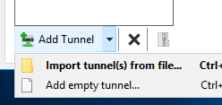
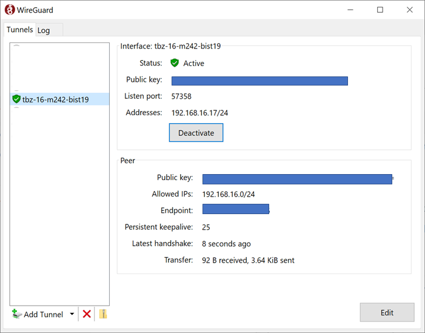

Einbinden der VPN Clients
-------------------------

Auf jedem Client muss das VPN [WireGuard](https://www.wireguard.com/install/) installiert und konfiguriert werden.

Ist die VM zugreifbar können in einem zweiten Schritt die Services, z.B. ein Web Server, mittels [Portweiterleitung](#portweiterleitung) im Internet zur Verfügung gestellt werden.

### VPN

*Das konventionelle VPN bezeichnet ein virtuelles privates (in sich geschlossenes) Kommunikationsnetz. Virtuell in dem Sinne, dass es sich nicht um eine eigene physische Verbindung handelt, sondern um ein bestehendes Kommunikationsnetz, das als Transportmedium verwendet wird. Das VPN dient dazu, Teilnehmer des bestehenden Kommunikationsnetzes an ein anderes Netz zu binden.*

Installieren von [WireGuard](https://www.wireguard.com/install/) auf dem Client, dass kann ein Notebook, Raspberry Pi o.ä. sein.

In den Unterlagen zum Modul/Kurs finden Sie eine Vorlagen, z.B. `wg1-template.conf` und eine Liste von IP-Adressen der Server und Ihren Key und IP-Adresse für das VPN Netzwerk.

Vervollständigen Sie die Vorlage und ersetzen dabei die Einträge `<replace IP>` und `<replace Key>` durch Ihre Werte laut Liste.

Die Konfigurationsdatei sieht in etwa so aus:

    [Interface]
    Address = <replace IP>/24
    PrivateKey = <replace Key>
    
    [Peer]
    PublicKey = xxxxxxxxxxxxxxxxxxxxxxxxxxxxxxxx
    Endpoint  = yyyyyyyyyyyyyyyyyy:518zz
    
    AllowedIPs = 192.168.xx.0/24
    
    # This is for if you're behind a NAT and
    # want the connection to be kept alive.
    # PersistentKeepalive = 25

Handelt es sich beim Client z.B. um einen Raspberry Pi, welcher für andere im VPN sichtbar sein soll, aktivieren Sie den Eintrag `PersistentKeepalive` bzw. kommentieren diesen aus.

**Vorsicht:** Dadurch ist die IP-Adresse und alle Ports für alle im VPN sichtbar. Sollte in Unternehmensnetzwerken nur nach Rücksprache mit dem Sicherheitsverantwortlichen aktiviert werden.

Starten Sie die WireGuard Software und fügen die ergänzte Vorlage WireGuard als Tunnel hinzu:

Und aktivieren Sie den Tunnel:

Die VMs sind nun mittels IP-Adresse inkl. allen Ports im VPN sichtbar.

### Portweiterleitung

*Eine Portweiterleitung (englisch port forwarding) ist die Weiterleitung einer Verbindung, die über ein Rechnernetz auf einem bestimmten Port eingeht, zu einem anderen Computer.*

Auf jeder VM befindet sich eine Datei `~/.ssh/ssh_tunnel`. Mittels dieser Datei und ssh ist es möglich jeden Port auf der VMs über den [Gateway](Gateway.md) im Internet zur Verfügung zu stellen.

Der Syntax ist wie folgt:

    ssh -i ~/.ssh/ssh_tunnel -N -R <Port auf Gateway>:localhost:<lokaler Port> <Gateway Server>
    
Der Port auf dem Gateway berechnet sich wie folgt:

    dritte und vierte Stelle der IP-Adresse der VM  + 10000,  
    Bsp: 192.168.62.11 ergibt 16211, 192.168.63.29 = 16329, etc.     
    
Das ergibt folgenden Befehl:

    ssh -i ~/.ssh/ssh_tunnel -N -R 16211:localhost:80 gateway.northeurope.cloudapp.azure.com
    
Damit wird der Web Server auf der VM mittels [http://gateway.northeurope.cloudapp.azure.com:16211]( http://gateway.northeurope.cloudapp.azure.com:16211) im Internet verfügbar.

### Quellen

* [VPN](https://de.wikipedia.org/wiki/Virtual_Private_Network)
* [Portweiterleitung](https://de.wikipedia.org/wiki/Portweiterleitung) 

