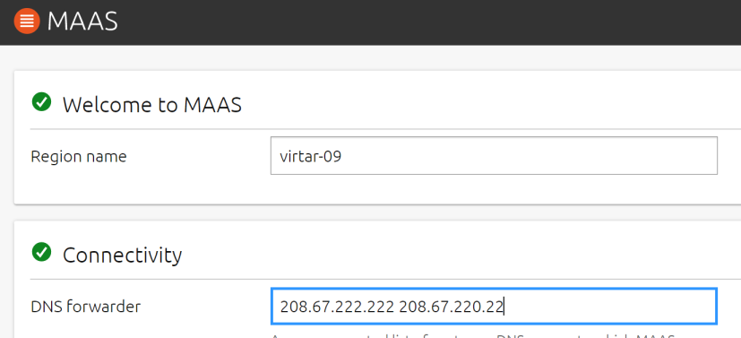
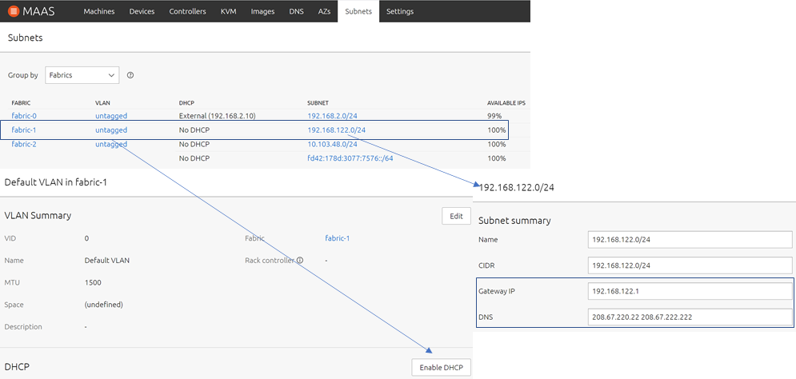
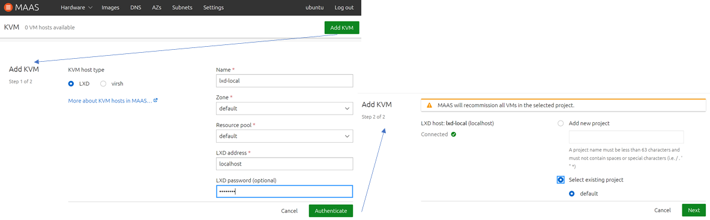

MAAS in MAAS
============

### Installation

Ab Version 3.0 von [MAAS](https://maas.io) kann MAAS auch in MAAS betrieben werden. Dafür werden KVM Maschinen mit [Linux Containern (lxd)](https://linuxcontainers.org/) verwendet.

Um die MAAS VMs anzulegen, ist in das MAAS einzuloggen und folgende Befehle auszuführen:

    cd lernmaas
    git pull
    createvms config.yaml virtar 5 
    
Nachdem die VMs den Status `Ready` erreicht haben, ist VM in VM zu aktivieren:

    enablevminvm virtar
    
Anschliessend AZ (mit WireGuard Keys) zuordnen und VMs deployen.

***
### Konfiguration

Nach erfolgreicher Installation (dauert ca. 10 Minuten), ist das MAAS UI anzuwählen (User: ubuntu, Password: password):

    http://<ip vm>:5240
    
Er erscheint der Welcome Assistent zur Konfiguration von DNS und SSH-Keys.

Als SSH-Key sollte der generierte Key unter `~/.ssh/id_rsa.pub` angegeben werden.

    cat ~/.ssh/id_rsa.pub

**Netzwerk**

Die Installation richtet ein Host-only Netzwerk `192.168.122.0/24` ein.

Für dieses Netzwerk ist der Gateway, die DNS Server und DHCP (mit Standardwerten) einzurichten:

Um auf die VMs im MAAS in MAAS zuzugreifen zu können, sollte ein VPN (WireGuard) eingerichtet werden. Die Details stehen [hier](https://github.com/mc-b/lernmaas/blob/master/doc/MAAS/Gateway.md).

**KVM**

Bei der Installation wurde [Linux Containern (lxd)](https://linuxcontainers.org/lxd/introduction/) mit Unterstützung von VMs installiert. D.h. mittels dem CLI [lxc](https://linuxcontainers.org/lxc/introduction/) können Container oder VMs erzeugt werden.

Damit MAAS via [Linux Containern (lxd)](https://linuxcontainers.org/lxd/introduction/) VMs erzeugen kann, ist die eigene VM als KMV Host einzutragen (LXD password: password)

**Preseed**

Ab Version 2.9 steht [Cloud-init](https://cloudinit.readthedocs.io/en/latest/) zur Verfügung. 

Soll zusätzlich die [lernMAAS](https://github.com/mc-b/lernmaas) Funktionalität verwendet werden, ist das [Pressed Script](https://maas.io/docs/snap/3.0/ui/custom-machine-setup) in der MAAS VM zu installieren:

    git clone https://github.com/mc-b/lernmaas.git
    sudo cp lernmaas/preseeds/* /etc/maas/preseeds/

Weitere Möglichkeiten wäre die Verwendung des [MAAS CLIs](https://maas.io/docs/snap/2.9/cli/maas-cli) oder das Einrichten einer gemeinsamen Datenablage. Die Details sind in der [lernMAAS Installation](https://github.com/mc-b/lernmaas/blob/master/doc/MAAS/Install.md) zu finden.

***
### Nützliche lxc Befehle

[lxc](https://linuxcontainers.org/lxc/introduction/) ist das CLI wo mit dem [lxd](https://linuxcontainers.org/lxd/introduction/) Daemon kommuniziert.

**Nützliche Befehle sind:**

Auflisten der aktiven VMs/Container

    sudo lxc list
    
Anzeige der Consolenausgabe einer VM

    sudo lxc console <vm>
    
Wechsel in die VM (ohne Password) 

    sudo lxc exec <vm> bash

### Links

* [Running virtual machines with LXD 4.0](https://discuss.linuxcontainers.org/t/running-virtual-machines-with-lxd-4-0/7519)
* [Cloud-init Beispiele](https://github.com/mc-b/iac/blob/main/cloud-iac.md)
