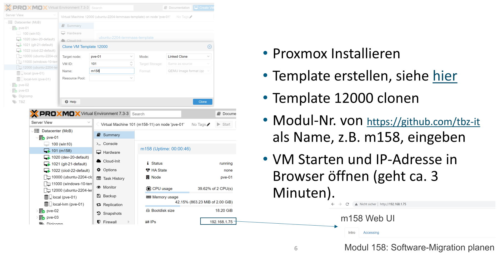

Proxmox VE
==========

Proxmox VE (Proxmox Virtual Environment; kurz PVE) ist eine auf Debian basierende Open-Source-Virtualisierungsplattform zum Betrieb von virtuellen Maschinen mit einem Webinterface zur Einrichtung und Steuerung von x86-Virtualisierungen. Die Umgebung basiert auf QEMU mit der Kernel-based Virtual Machine (KVM). PVE bietet neben dem Betrieb von klassischen virtuellen Maschinen (Gastsystemen), die auch den Einsatz von Virtual Appliances erlauben, auch LinuX Containers (LXC) an.

Nach der [Installation](https://www.proxmox.com/de/proxmox-ve/erste-schritte) von Proxmox muss ein Standard Image mit dem LernMAAS Repository erstellt werden.

Dazu auf der Proxmox Maschine einloggen und mit folgenden Befehlen ein VM Template erzeugen

    export TEMPLATE=12000
    
    rm /etc/apt/sources.list.d/pve-enterprise.list
    apt update -y
    apt update -y && apt install libguestfs-tools -y
    
    mkdir -p /var/lib/vz/cloudimg 
    wget -O /var/lib/vz/cloudimg/jammy-server-lernmaas-amd64.img https://cloud-images.ubuntu.com/jammy/current/jammy-server-cloudimg-amd64.img
    virt-customize -a /var/lib/vz/cloudimg/jammy-server-lernmaas-amd64.img --install qemu-guest-agent    
    
    # Installation LernMAAS Scripts
    virt-customize -a /var/lib/vz/cloudimg/jammy-server-lernmaas-amd64.img --install jq   
    virt-customize -a /var/lib/vz/cloudimg/jammy-server-lernmaas-amd64.img --install markdown 
    virt-customize -a /var/lib/vz/cloudimg/jammy-server-lernmaas-amd64.img --install git     
    virt-customize -a /var/lib/vz/cloudimg/jammy-server-lernmaas-amd64.img --run-command 'git clone https://github.com/mc-b/lernmaas /opt/lernmaas'
    
    # Netzwerk - neue IP-Adressen holen, weil /etc/machine-id identisch ist.
    #virt-customize -a /var/lib/vz/cloudimg/jammy-server-lernmaas-amd64.img --copy /opt/lernmaas/cloud.cfg.d/99_lernmaas.cfg:/etc/cloud/cloud.cfg.d/
    cat <<EOF >99_lernmaas.cfg
    #cloud-config
    runcmd:
     - sudo rm /etc/machine-id
     - sudo systemd-machine-id-setup
     - sudo sudo ip address flush scope global
     - sudo sudo dhclient -v    
     - sudo su - ubuntu -c "(cd /opt/lernmaas ; git pull ; bash -x services/cloud-init.sh)"  
    EOF
    virt-customize -a /var/lib/vz/cloudimg/jammy-server-lernmaas-amd64.img --copy-in 99_lernmaas.cfg:/etc/cloud/cloud.cfg.d/  
    [ -f wireguard ] && { virt-customize -a /var/lib/vz/cloudimg/jammy-server-lernmaas-amd64.img --copy-in wireguard:/opt/lernmaas/; }    
    
    qm destroy ${TEMPLATE}
    qm create ${TEMPLATE} --memory 2048 --cores 2 --name "ubuntu-2204-lernmaas-template" --net0 virtio,bridge=vmbr0 --scsihw virtio-scsi-pci
    qm set ${TEMPLATE} --scsi0 local-lvm:0,import-from=/var/lib/vz/cloudimg/jammy-server-lernmaas-amd64.img
    
    qm set ${TEMPLATE} --ide2 local-lvm:cloudinit
    qm set ${TEMPLATE} --boot order=scsi0
    qm set ${TEMPLATE} --serial0 socket --vga serial0
    qm resize ${TEMPLATE} scsi0 +16G
    
    qm set ${TEMPLATE} --ciuser ubuntu
    qm set ${TEMPLATE} --cipass insecure    
    qm set ${TEMPLATE} --ipconfig0 ip=dhcp    
    qm set ${TEMPLATE} --sshkeys /etc/pve/priv/authorized_keys
    # QEmu Agent enablen, ansonsten wird keine IP-Adresse angezeigt
    qm set ${TEMPLATE} --agent 1
    
    qm template ${TEMPLATE}

**Testen** 

  

Entweder über die Proxmox Weboberfläche das Template ${TEMPLATE} Clonen und als Hostname eine Modul-Nr. laut [https://github.com/tbz-it/](https://github.com/tbz-it/) ein '-' und eine Nummer zwischen 10 - 90 eingeben. Die zweite Nummer wird zum bestimmen der VPN IP-Adresse benutzt.

Alternativ können VMs auch via CLI erstellt werden. 

    qm clone ${TEMPLATE} 158 --name m158-58
    qm start 158
    qm clone ${TEMPLATE} 169 --name m169-69
    qm start 169 
    
Promox Oberfläche im Browser öffnen und die IP-Adresse, pro erstellter VM, im Tab Summary auslesen. Diese im Browser eingeben und den Anweisungen folgen.

**Aufräumen**

    qm stop 158
    qm destroy 158
    qm stop 169
    qm destroy 169   
    
### WireGuard

Soll das VPN WireGuard auch eingerichtet werden, ist die WireGuard Konfiguration (im Base64 Format) in das Image zu kopieren, bevor das Template erstellt wird!

    virt-customize -a /var/lib/vz/cloudimg/jammy-server-lernmaas-amd64.img --copy-in wireguard:/opt/lernmaas/
    
Um eine WireGuarg Konfiguration zu erstellen, siehe [createkeys](../../helper#createvms) .  

### Terraform

Es existiert auch ein Terraform Provider für Proxmox, siehe [hier](https://github.com/mc-b/terraform-lerncloud-proxmox).

### Links

* [virt-customize](https://manpages.ubuntu.com/manpages/bionic/man1/virt-customize.1.html)
* [Ubuntu cloned have the same ip but different mac address in NAT network](https://askubuntu.com/questions/1179897/ubuntu-18-04-guests-which-cloned-by-virtualbox-have-the-same-ip-but-different-ma)

