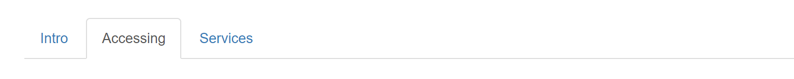

Hilfsscripts
============

Um die Scripts auszuführen, muss:
* das MAAS CLI installiert sein
* ein login in den MAAS Master stattgefunden haben
* die Umgebungsvariable PROFILE (= MAAS User) gesetzt sein.

createvms
---------

Erstellt einen Resource Pool und darin die Anzahl VMs anhand der [config.yaml](../config.yaml) Datei.

Die VMs sind anschliessend im Zustand `Ready` und können via MAAS Oberfläche deployt werden.

Der Aufruf von `createvms` ist wie folgt:

    cd lernmaas
    createvms <config.yaml> <Modul> <Anzahl VMs> <Suffix> <Offset>
    
Argumente:
* `config.yaml` - Datei. Alternativ kann auch eine andere Datei angegeben werden.
* `Modul` - Modulname, muss in `config.yaml` vorkommen
* `Anzahl VMs` - Anzahl der VMs die erstellt werden sollen. Die Anzahl muss durch die Anzahl KVM Maschinen teilbar sein. Die VMs werden gleichmässig auf die KVM Maschinen verteilt.
* `Suffix` - Optionaler freier Suffix, kann z.B. das Klassenkürzel oder das Datum des Kurses sein.
* `Offset` - Optionaler Versatz. Wird hier eine Zahl angegeben, werden die VMs ab diesem aufgezählt, z.B. bei 6 bekommt die erste VM die Bezeichnung <Modul>-06-<Suffix>.
    
**ACHTUNG**: die Anzahl VMs muss kleiner der Anzahl KVM Maschinen oder durch die Anzahl KVM Maschinen teilbar sein. Z.B. bei 6 Pods können 1 - 6, 12, 18, 24 etc. VMs erstellt werden.    
    
createkeys (deprecated - besser updateaz verwenden)
----------

Erzeugt die WireGuard Keys für den Gateway.

    createkeys <EndPoint> <SubNet> <Resource Pool>  
    
Nach dem Aufruf der Scripts wird eine Anleitung für die weiteren Schritte ausgegeben, z.B. 

    Key Generierung erfolgreich
    ---------------------------
    
    wg0.conf            - WireGuard Konfigurationsdatei fuer Gateway
    wg0-template.conf   - WireGuard Template fuer Clients. Vervollstandigen mit IP-Adresse und Private-Key. Ablegen zu den Unterlagen
    wg0.csv             - Liste der Clients. Zum Bearbeiten mit Excel und Eintragen der Lernenden
    <Pool>.html         - HTML Seite mit Servern und Clients zum Ablegen auf dem Gateway
    
    WireGuard Interface auf dem Gateway aktiveren:
    systemctl enable wg-quick@wg0.service
    systemctl start wg-quick@wg0.service

updateaz
--------

Ergänzt die [AZs](https://maas.io/docs/availability-zones) (Availability zones) von MAAS mit WireGuard Keys.

Zuerst müssen die [AZs](https://maas.io/docs/availability-zones) manuell (es gibt kein Befehle create für AZs im MAAS CLI) erstellt werden. 

Die Namensgebung ist dabei wie folgt:

* 192-168-<Subnet>-0

Anschliessend können die WireGuard Keys, wie bei `createkeys`, erstellt werden. Diese werden dann im Feld `Description`, als TAR Datei - Base64 codiert, der AZ abgestellt.

Der Aufruf von `updateaz` ist wie folgt:

    updateaz <EndPoint> <SubNet>
    
Nach dem Aufruf der Scripts wird eine Anleitung für die weiteren Schritte ausgegeben, z.B. 

    Key Generierung erfolgreich
    ---------------------------
    
    wg11.conf           - WireGuard Konfigurationsdatei fuer Gateway
    wg11-template.conf  - WireGuard Template fuer Clients. Vervollstandigen mit IP-Adresse und Private-Key. Ablegen zu den Unterlagen
    wg11.csv            - Liste der Clients. Zum Bearbeiten mit Excel und Eintragen der Lernenden
    wg11.tgz            - Konfigurationsdateien fuer die VMs und Clients.
    
    WireGuard Interface auf dem Gateway aktiveren:
    systemctl enable wg-quick@wg11.service
    systemctl start wg-quick@wg11.service

In der Datei `wg11.tgz` befinden sich die WireGuard Konfigurationsdateien nummeriert von `01.conf` - `99.conf`. 

Für die Zuordnung muss der Name der [VM](https://maas.io/docs/machine-overview) in der zweiten Stelle eine Nummer 01 - 99 enthalten und die VM einer der [AZs](https://maas.io/docs/availability-zones) zugeordnet sein. Die Zuordnung
der VMs zu einer AZ geht am einfachsten im [MAAS UI](http://localhost:5240).     
    
createk8svms
------------

Erstellt einen oder mehrere Kubernetes Cluster. Die Anzahl bestimmt dabei die Anzahl Cluster und nicht die Anzahl VMs.

Es wird zuerst auf dem ersten KVM-Pod die Anzahl Master erstellt und anschliessend auf jedem weiteren KVM-Pod ein Worker. 

In der [config.yaml](../config.yaml) müssen die Einträge für master (z.B. m000master) und Worker (z.B. m000worker) vorhanden sind. Diese werden separat ausgewertet, d.h. dem Master kann z.B. weniger RAM zugewiesen werden als dem Worker oder umgekehrt.

Der Aufruf von `createvms` ist wie folgt:

    createk8svms <config.yaml> <Modul> <Anzahl Cluster> <Suffix>   

ccopy
-----

`ccopy` exportiert die Container Images von einer laufenden Docker und/oder Kubernetes Umgebung nach `/data/templates/cr-cache/<Modul>` auf den MAAS Master.

`lernmaas` bzw. das Script [docker](../services/docker) verwendet diese exportieren Container Images und importiert diese, bevor der erste Container gestartet wird.

Das führt zu einem massiven Zeitgewinn, weil die Container Images nicht mehr über das Internet geholt werden müssen. Bei Kubernetes sind das alleine ca. 2 GB pro VM.

Der Aufruf von `ccopy` ist wie folgt:

    bash ccopy <Name Modul ohne -01> <IP-Adresse VM>
     
intro
-----

Installiert den Apache Web Server und erstellt eine Anleitung für die Machine (VM).

Das Helper Script ist in das Installationscript (`scripts/install.sh`) eines Repositories einzubinden:

    # Introseite
    bash -x /opt/lernmaas/helper/intro

Vom Script welchen folgende Dateien im Repository ausgewertet bzw. nach HTML gewandelt:

* `README.md` - als Intro Seite
* `ACCESSING.md` - mit den Informationen wie auf die VM zugegriffen werden kann. Ist diese Datei nicht vorhanden, wird geschaut ob ein Datei `.ssh/passwd`, erstellt mittels `ssh: generate` vorhanden ist. Wenn ja, werden Standardinformationen angezeigt.
* `SERVICES.md` - ist Reserviert für eine Auflistung von Services, welche in der VM zur Verfügung stehen.

In alle Markdown (.md) Dateien können folgende Umgebungsvariablen eingefügt werden:

* `${ADDR}` - IP-Adresse der VM. Ist WireGuard aktiv wird diese IP genommen.
       
tocsv (deprecated - besser updateaz verwenden)
-----

Exportiert VM Hostname und IP-Adresse ins CSV Format, z.B. um es mit Excel weiterverarbeiten zu können.

Hostname und IP-Adresse werden aus einem Resource Pool von MAAS Master geholt.

Der Aufruf von `tocsv` ist wie folgt:

    tocsv <Resource Pool MAAS>

    