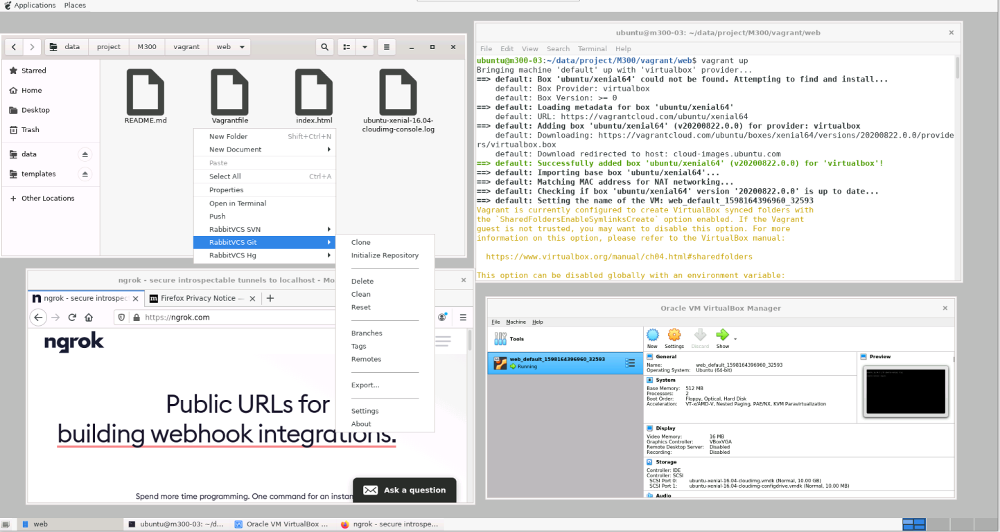

VM Hilfsscripts
===============

Folgende Hilfsscripts installieren weitere Software und Services in den VMs.

Sie werden in der Datei [config.yaml](../config.yaml) unter `scripts` eingetragen.

Beispiel:

    # Modul 300: Plattformuebergreifende Dienste in ein Netzwerk integrieren
    m300:
      vm:  
        storage: 24
        memory:  4864
        cores: 2
        count: 20
      services:
        nfs: true
        docker: true
        k8s: master
        wireguard: use
        ssh: generate
        samba: false
        firewall: false
      scripts: vagrant.sh,eclipse-theia.sh,gnome-desktop.sh
      repositories: 
      
Eclipse Theia
-------------

- - -

[Eclipse Theia](https://theia-ide.org/) ist eine Entwicklungsumgebungen (IDE), angelehnt an VSCode, welche im Browser läuft.

Das Script `eclipse-theia.sh` startet die IDE in einem Container und stellt die IDE auf Port 32400 zur Verfügung.

Gnome Desktop
-------------

- - - 

Gnome Desktop installiert eine X-Windows Umgebung mit einer minimalen Installation von Gnome Desktop mit:
* Firefox Browser
* File Explorer 
* GEdit

Ausserdem sind die Git Befehle, Open Terminal und Vorlagen für Markdown, Dockerfile und Vagrant im File Explorer integriert. 

lernkube
--------

Clont die Sourcen von [lernkube](https://github.com/mc-b/lernkube) ins Homeverzeichnis und kopiert die Shellscripts wie `runbash` etc. nach /usr/local/bin.

Erleichtert die Verwendung von Kubernetes.

modtec
------

Umgebung für den Kurs [Moderne Technologien](https://github.com/mc-b/modtec) u.a. Mosquitto, Kafka, etc.

Wird für mehrere Kurse verwendet, deshalb hier als Script ausgeführt.

Proxy Server
------------

Das Script proxy-server.sh installiert und aktiviert den Proxy Server Privoxy und den [ngrok](ngrok.com) Client in der VM.
 
Mit dem Proxy Server können die Einschränken, dass bestimmte Webseiten, z.B. ngrok.com nicht angewählt werden können, umgangen werden.
 
Dazu muss auf dem Notebook der Lernenden die VM (IP von WireGuard und Port 8118) als Proxy Server angegeben werden (siehe oben und hier). Anschliessend erfolgt der Zugriff auf des Internet via -> NB -> VM mit Proxy Server -> init 7 Standleitung (cloud.tbz.ch).
 
Aktuell ist dieses Settings in das Modul 242 eingebaut.

TBZ Deployer
------------

- - -

Der TBZ-Deployer ermoeglicht fuer jeden Lehrenden einer Klasse mehrere Container in einem Namespace zu starten.

Der TBZ-Deployer basiert auf einer Vertiefungsarbeit an der TBZ HF von Niklaus Liechti - https://github.com/nliechti/tbz_hf_va.

Vagrant
-------

Das Script vagrant.sh installiert [Vagrant]() und [VirtualBox]() in der VM.

Diese muss vorher mittels dem Helper Script [enablevminvm](../helper/enablevminvm) für VM in VM freigeschaltet werden.

Zusammen mit dem gnome-desktop Script kann innerhalb der VM, dass VirtualBox GUI verwendet werden.

